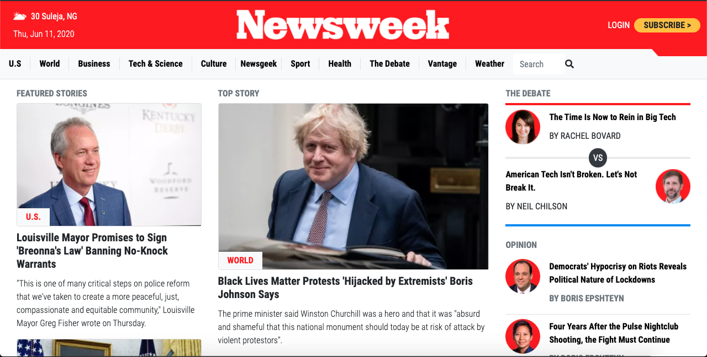

# Bootstrap

> This project replicates the Newsweek website using Bootstrap 4, making sure Bootstrap CSS classes are used wherever possible, the layout should look as exact as the original page across all screen sizes.

The is a replica of the Newsweek website using Bootstrap.

## Built With

- HTML
- Bootstrap 4
- CSS
- Google Fonts
- Font Awesome icons

## Live Demo

[Live Demo Link](https://raw.githack.com/ahmadchata/newsweek/feature-homepage/index.html)

## Author

👤 **Ahmad Chata**

- Github: [@ahmadchata](https://github.com/ahmadchata)
- Twitter: [@ahmadchata](https://twitter.com/ahmadchata)
- Linkedin: [Ahmad Chata](https://www.linkedin.com/in/ahmad-chata-957b9b51/)

## 🤝 Contributing

Contributions, issues and feature requests are welcome! Start by:

- Forking the project
- Cloning the project to your local machine
- `cd` into the project directory
- Run `git checkout -b your-branch-name`
- Make your contributions
- Push your branch up to your forked repository
- Open a Pull Request with a detailed description to the development branch of the original project for a review

## Show Support

- Give a ⭐ if you like this project.

## Acknowledgements

- Hat tip to Newsweek
- Odin project
- Microverse

## 📝 License

This project is [MIT](https://opensource.org/licenses/MIT) licensed.
